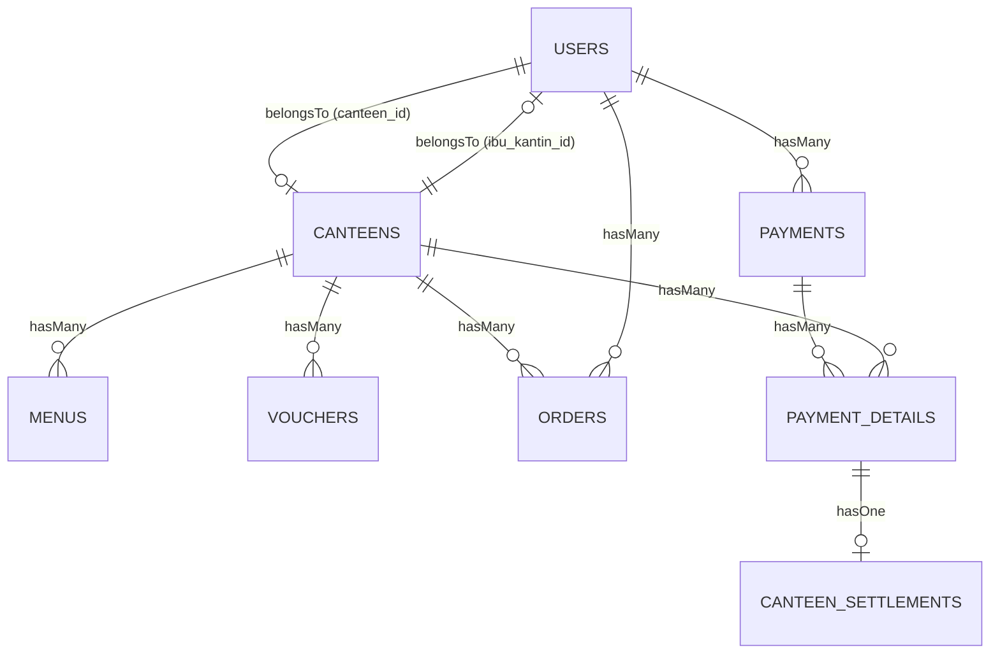

# Hulahup App 🍱 - Aplikasi Kantin Digital Telkom University

Hulahup App adalah platform kantin digital (e-canteen) berbasis web yang dirancang khusus untuk memfasilitasi pemesanan makanan dan minuman bagi sivitas akademika di lingkungan Telkom University (Tel-U). Aplikasi ini mempertemukan pembeli (mahasiswa/staf), pemilik kantin (Ibu Kantin), dan administrator sistem dalam satu ekosistem yang terintegrasi.

---

## 🚀 Fitur Utama & Keunggulan
- **Pemesanan Multi-Kantin**: Pembeli dapat memasukkan item dari berbagai kantin berbeda ke dalam satu keranjang belanja. Pesanan akan otomatis dipecah per kantin (*split order*) di backend untuk mempermudah pemrosesan oleh masing-masing pemilik kantin.
- **✨ AI Chatbot Asisten Kuliner (Gemini AI)**: Fitur chatbot pintar di navbar yang berfungsi merekomendasikan hidangan terpopuler, menu ramah kantong, minuman segar, atau makanan penutup berdasarkan database menu aktif. Menggunakan bahasa santai khas mahasiswa.
- **Pembayaran Fleksibel**: Mendukung pembayaran instan menggunakan e-wallet internal **Saldo TyU-Pay** maupun integrasi gerbang pembayaran online **Midtrans** (QRIS, GoPay, ShopeePay, Virtual Account, dll).
- **Live Order Ticker & Tampilan Realtime**: Halaman landing menampilkan jumlah kantin aktif, jumlah menu, serta ticker pesanan terbaru yang diperbarui secara realtime dari database.
- **Switch View Mode**: Akun dengan peran Admin dan Ibu Kantin dapat beralih tampilan sementara ke "Mode Pembeli" untuk melihat antarmuka pembeli secara langsung tanpa perlu berganti akun.

---

## 🛠️ Spesifikasi Teknologi (Tech Stack)

### Backend & Core
- **Bahasa Pemrograman**: PHP v8.2+
- **Framework Utama**: Laravel v12.x
- **Database**: MySQL (didukung XAMPP untuk localhost / SQLite untuk pengujian)

### Frontend & Build System
- **Template Engine**: Laravel Blade (dengan struktur dinamis & responsif)
- **CSS Framework**: TailwindCSS v4.0.0 (menggunakan compiler modern `@tailwindcss/vite`)
- **Asset Bundler**: Vite v7.0.7
- **Runtime Environment**: Node.js v20.0.0+ & NPM v10.0.0+

### Integrasi API & Layanan Eksternal
- **Google Gemini API**: Menggunakan model `gemini-1.5-flash` untuk chatbot asisten pemesanan pintar.
- **Midtrans Payment Gateway**: Menggunakan SDK `midtrans/midtrans-php` untuk pemrosesan Snap Token dan Webhook Payment Notification.

---

## 👥 Peran Pengguna (User Roles)

Aplikasi memiliki **3 peran utama** yang diatur menggunakan sistem RBAC (Role-Based Access Control) berbasis middleware:

### 1. 🔑 Admin (System Administrator)
Akses ke panel admin pusat untuk mengawasi seluruh aktivitas operasional kantin kampus.
*   **Dashboard Admin**: Statistik total pesanan, jumlah pengguna aktif, pesanan tertunda/diproses/selesai, riwayat pesanan terbaru, dan performa masing-masing kantin secara global.
*   **Kelola Pengguna**: Melihat status login pengguna, mengubah peran akun (contoh: mengubah pembeli biasa menjadi pemilik kantin), mengedit profil, dan menghapus akun pengguna.
*   **Kelola Voucher Global**: Membuat, mengedit, dan menghapus voucher diskon bertipe persentase atau potongan nominal dengan batasan tanggal berlaku serta kuota maksimum penggunaan (*max uses*).
*   **Rekapitulasi Laporan (CSV Export)**: Mengekspor data laporan transaksi pesanan, daftar kantin aktif, dan daftar pengguna terdaftar ke format CSV untuk analisis eksternal.

### 2. 👩‍🍳 Ibu Kantin (Pemilik Kantin)
Dashboard personal bagi pemilik gerai/kantin untuk mengelola bisnis mereka secara mandiri.
*   **Dashboard Penjualan**: Ringkasan total menu, jumlah voucher, jumlah pesanan masuk, total pendapatan (*revenue*), status pesanan (pending/processing/completed), dan daftar pesanan terbaru khusus gerainya.
*   **Kelola Profil Kantin**: Mengedit nama gerai, deskripsi, lokasi gedung kampus, status gerai (Buka/Tutup), dan mengunggah gambar profil/cover gerai.
*   **Manajemen Menu (CRUD)**: Menambah, mengubah, atau menghapus menu makanan/minuman/camilan. Mengatur harga, rating, deskripsi, foto menu, serta status ketersediaan (*is_available*).
*   **Kelola Voucher Toko**: Membuat kode promo/diskon khusus yang hanya dapat digunakan untuk menu di gerainya sendiri.
*   **Pemrosesan Pesanan (Order Status Tracking)**: Menerima pesanan masuk, mengubah status menjadi *Processing* (Sedang Dimasak) -> *Completed/Selesai* (Siap Diambil/Diantar) -> *Cancelled* jika stok habis.
*   **Laporan & Cetak PDF**: Mengekspor riwayat transaksi pesanan dan daftar menu gerai ke file CSV, serta mencetak laporan berformat PDF secara langsung dari browser.

### 3. 🛍️ Pembeli (Buyer)
Tipe pengguna ini dapat mendaftar dalam dua jalur otomatis:
-   **🎓 Mahasiswa Tel-U**: Terdeteksi otomatis jika mendaftar menggunakan email berdomain `@student.telkomuniversity.ac.id` atau mengisi kolom **NIM (12 digit)**. Mendapatkan lencana khusus *"✨ Mahasiswa Tel-U"* di profil serta akses ke voucher/promo khusus mahasiswa.
-   **👤 User Umum**: Tamu, dosen, staf, atau masyarakat umum yang tidak memiliki NIM/email mahasiswa. Memiliki fitur transaksi yang sama dengan mahasiswa.

*Fitur untuk Pembeli:*
*   **Landing Page Interaktif**: Menampilkan jumlah gerai aktif, variasi menu, live ticker transaksi terbaru, serta menu terlaris secara realtime berdasarkan volume penjualan tertinggi di database.
*   **Pencarian & Filter Toko**: Menjelajahi katalog kantin, melihat menu berdasarkan kategori (makanan berat, minuman, camilan), serta filter gerai yang sedang buka.
*   **Keranjang Belanja (Cart System)**: Mengelola item pesanan, mengubah jumlah porsi, serta otomatis mengelompokkan menu berdasarkan gerai asalnya.
*   **Manajemen Saldo TyU-Pay**: Dompet digital internal yang dapat di-top up secara instan untuk mempercepat pembayaran tanpa melalui gerbang eksternal.
*   **Pembayaran Online (Midtrans)**: Pembayaran aman dengan integrasi Snap Popup yang mendukung GoPay, ShopeePay, QRIS, Virtual Account bank transfer.
*   **Notifikasi & Ticker**: Notifikasi dinamis saat pesanan diubah statusnya oleh Ibu Kantin, peringatan saldo TyU-Pay hampir habis (jika di bawah Rp 10.000), dan status transaksi pembayaran.
*   **Riwayat & Reorder**: Melihat daftar pesanan masa lalu dan melakukan pemesanan ulang (*reorder*) secara instan dengan menduplikat item pesanan lama ke dalam keranjang.

---

## 🗄️ Struktur Database & Relasi Model

Relasi antar model Laravel yang digunakan adalah sebagai berikut:



### Penjelasan Relasi:
- **`User` (Tabel `users`)**: Menyimpan data akun. Memiliki `role` (`admin`, `ibu_kantin`, `mahasiswa`, `user`). Terhubung dengan gerai (`canteen_id`) jika perannya adalah pemilik kantin.
- **`Canteen` (Tabel `canteens`)**: Menyimpan data identitas gerai kantin. Dimiliki oleh satu User (`ibu_kantin_id`). Memiliki relasi ke menu, voucher, dan order.
- **`Menu` (Tabel `menus`)**: Menyimpan hidangan kuliner yang dijual. Setiap menu merupakan milik satu gerai kantin (`canteen_id`).
- **`Voucher` (Tabel `vouchers`)**: Menyimpan data kupon potongan harga. Dapat dibatasi per kantin (`canteen_id` terisi) atau bersifat global (jika `canteen_id` bernilai `null`).
- **`Order` (Tabel `orders`)**: Menyimpan transaksi pemesanan makanan. Berisi kolom `items` (bertipe JSON untuk menampung detail menu, harga, dan kuantitas), `status` pemrosesan, serta terhubung ke pembeli (`user_id`) dan kantin (`canteen_id`).
- **`Payment` & `PaymentDetail` (Tabel `payments` & `payment_details`)**: Digunakan untuk mencatat riwayat transaksi pembayaran digital. `PaymentDetail` memetakan pembagian nominal pembayaran untuk masing-masing gerai kantin jika pembeli membeli dari beberapa gerai sekaligus.
- **`CanteenSettlement` (Tabel `canteen_settlements`)**: Pencatatan penarikan/pemberian hasil penjualan digital dari sistem utama Hulahup ke saldo rekening bank milik Ibu Kantin.

---

## ⚡ Panduan Instalasi di Localhost (XAMPP)

Ikuti langkah-langkah di bawah ini untuk menjalankan aplikasi di komputer lokal Anda:

### Prasyarat System
1. PHP v8.2 atau lebih baru (Pastikan extension `fileinfo`, `pdo_mysql`, dan `openssl` aktif di `php.ini`).
2. Composer v2.x.
3. Node.js v20.x atau lebih baru & NPM.
4. XAMPP (Apache dan MySQL).

---

### Langkah-Langkah Setup

**1. Clone & Masuk ke Folder Projek**
Letakkan folder projek di direktori lokal Anda (misal di `C:/xampp/htdocs/` atau folder kerja Anda), kemudian buka terminal di folder tersebut.

**2. Jalankan Apache & MySQL**
Buka XAMPP Control Panel, jalankan modul **Apache** dan **MySQL**.

**3. Buat Database**
- Buka browser dan akses `http://localhost/phpmyadmin/`.
- Klik menu **New** -> beri nama database: `hulahup_db` -> Klik **Create**.

**4. Konfigurasi File Environment (`.env`)**
Salin file `.env.example` menjadi `.env`:
```bash
copy .env.example .env
```
Buka file `.env` yang baru dibuat, lalu sesuaikan konfigurasi berikut:

*   **Database Config (Default XAMPP)**:
    ```env
    DB_CONNECTION=mysql
    DB_HOST=127.0.0.1
    DB_PORT=3306
    DB_DATABASE=hulahup_db
    DB_USERNAME=root
    DB_PASSWORD=
    ```

*   **Google Gemini AI API Key**:
    Dapatkan API Key dari [Google AI Studio](https://aistudio.google.com/) dan masukkan ke env:
    ```env
    GEMINI_API_KEY=isi_dengan_api_key_gemini_anda
    ```

*   **Midtrans API Key (Sandbox Mode)**:
    Dapatkan credentials dari dashboard [Midtrans Sandbox](https://dashboard.sandbox.midtrans.com/) Anda:
    ```env
    MIDTRANS_MERCHANT_ID=isi_merchant_id
    MIDTRANS_CLIENT_KEY=isi_client_key
    MIDTRANS_SERVER_KEY=isi_server_key
    MIDTRANS_IS_PRODUCTION=false
    ```

**5. Install Dependencies Backend**
```bash
composer install
```

**6. Generate Application Key**
```bash
php artisan key:generate
```

**7. Jalankan Database Migration & Seeders**
Migrasikan struktur tabel database beserta data demo bawaan (akun uji coba, kantin, menu contoh):
```bash
php artisan migrate:fresh --seed
```

**8. Install Dependencies Frontend & Build Assets**
```bash
npm install
npm run build
```

**9. Jalankan Aplikasi**
Buka terminal dan jalankan server pengembangan Laravel:
```bash
php artisan serve
```
Buka browser Anda dan akses: `http://localhost:8000` ✅.

---

### Pengembangan Aktif (Dev Mode dengan Hot Reload)
Jika Anda ingin mengubah kode CSS/JS/Blade secara realtime, buka dua terminal terpisah:
- **Terminal 1**: `php artisan serve` (Server PHP)
- **Terminal 2**: `npm run dev` (Vite Hot-Module Replacement)

---

## 🔑 Data Akun Uji Coba (Kredensial Login)

Setelah menjalankan database seeder pada langkah ke-7, Anda dapat masuk ke aplikasi menggunakan data akun uji coba berikut:

| Peran (Role) | Nama Pengguna | Username / Email | Password | Keterangan |
| :--- | :--- | :--- | :--- | :--- |
| **Admin** | Administrator | `admin` / `admin@hulahup.com` | `admin123` | Akses penuh panel admin |
| **Ibu Kantin 1** | Bu Sari | `busari_kantin` / `busari@hulahup.com` | `kantin123` | Pemilik gerai **Kantin Barokah** |
| **Ibu Kantin 2** | Bu Dewi | `budewi_kantin` / `budewi@hulahup.com` | `kantin123` | Pemilik gerai **Kantin Segar** |
| **Ibu Kantin 3** | Bu Rina | `burina_kantin` / `burina@hulahup.com` | `kantin123` | Pemilik gerai **Kantin Nusantara** |
| **Mahasiswa** | Budi Mahasiswa | `budi_mhs` / `budi@student.telkomuniversity.ac.id` | `budi12345` | Pembeli (Saldo awal: Rp 50.000, NIM: 103112430001) |
| **Pembeli Umum** | *(Dapat mendaftar akun baru)* | Via formulir Sign Up | Ditentukan sendiri | Mendaftar sebagai pembeli non-mahasiswa |
